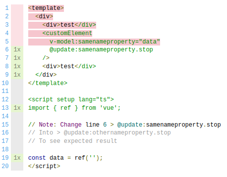
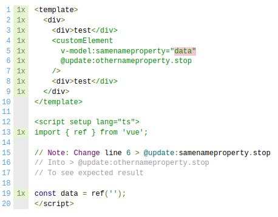

# Demo v8 Coverage Issue

This repository has been initialized to highlight issues about the @vitest/coverage-v8 coverage provider.

This repository uses

- Vue 3 (v3.4.37)
- TypeScript (v5.5.3)
- Vite (v5.4.1)
- Vitest (v2.0.5)
- @vitest/coverage-v8 (v2.0.5)

## Architecture

The component file `src/components/custom-component.vue`, is being tested from the `tests/custom-component.spec.js` test file.

The `vite.config.ts` contains all coverage informations.

The following command is used to launch tests.

```console
npm run test
```

## Observed results

When launching the test with a property `v-model:namedproperty` AND a listener `@update:namedproperty` on a custom element.

```
 % Coverage report from v8
-------------------|---------|----------|---------|---------|-------------------
File               | % Stmts | % Branch | % Funcs | % Lines | Uncovered Line #s 
-------------------|---------|----------|---------|---------|-------------------
All files          |   54.54 |      100 |       0 |   54.54 |                   
 ...-component.vue |   54.54 |      100 |       0 |   54.54 | 1-5               
-------------------|---------|----------|---------|---------|-------------------

=============================== Coverage summary ===============================
Statements   : 54.54% ( 6/11 )
Branches     : 100% ( 0/0 )
Functions    : 0% ( 0/1 )
Lines        : 54.54% ( 6/11 )
================================================================================
```

The coverage shows a lot of lines being uncovered.

`coverage/lcov-report/index.html` shows the following :



## Expected results

When editing line 6 of file `src/components/custom-component.vue` to replace 

> @update:samenameproperty.stop

with

> @update:othernameproperty.stop

```
 % Coverage report from v8
-------------------|---------|----------|---------|---------|-------------------
File               | % Stmts | % Branch | % Funcs | % Lines | Uncovered Line #s 
-------------------|---------|----------|---------|---------|-------------------
All files          |     100 |      100 |       0 |     100 |                   
 ...-component.vue |     100 |      100 |       0 |     100 |                   
-------------------|---------|----------|---------|---------|-------------------

=============================== Coverage summary ===============================
Statements   : 100% ( 11/11 )
Branches     : 100% ( 0/0 )
Functions    : 0% ( 0/1 )
Lines        : 100% ( 11/11 )
================================================================================
```

The coverage shows the expected result.

`coverage/lcov-report/index.html` shows the following :

